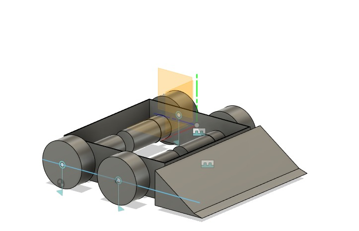
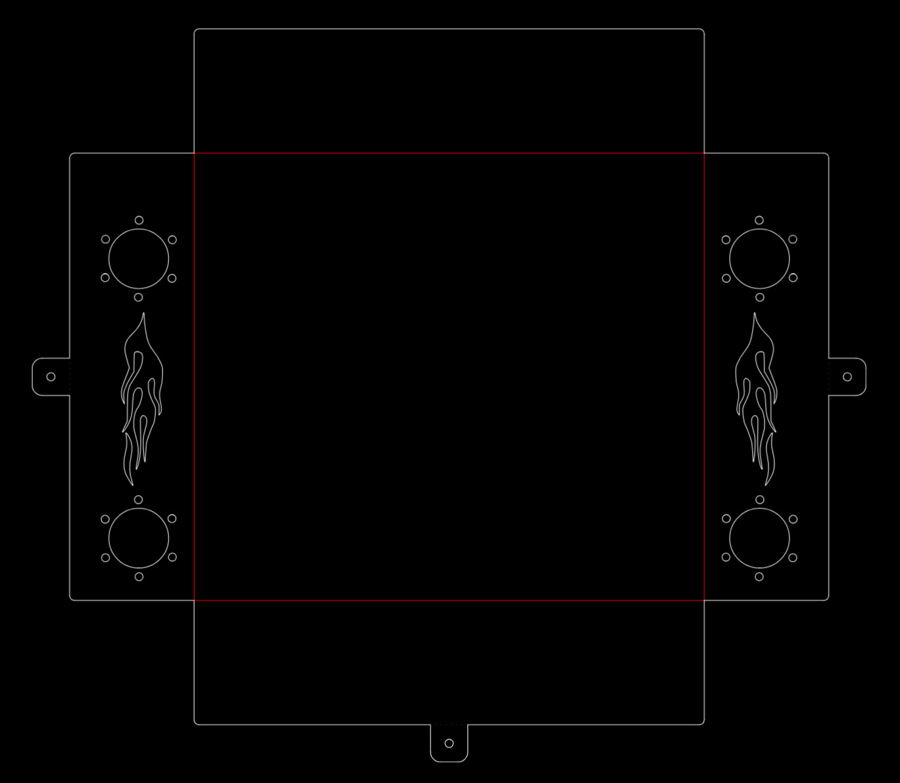

# RC Sumobot

A 300×300mm RC-controlled sumobot designed from scratch and fabricated using laser cutting. Built as a complete mechanical and electronics integration project — from CAD to competition-ready hardware.

---

## Overview

| Spec | Details |
|---|---|
| Dimensions | 300 × 300 mm |
| Chassis Material | Mild Steel (laser cut) |
| Drive System | DC Gear Motors (dual) |
| Motor Driver | BTS7960 / L298N |
| Controller | ESP32 + RC Receiver |
| CAD Tool | Fusion 360 + AutoCAD (2D layouts) |
| Fabrication | Laser Cutting |

---

## Design

### 3D Model (Fusion 360)

### Laser Cut Layout

The chassis was designed with a function-first approach — low center of gravity, optimized weight distribution, and mounting points for all electronics integrated directly into the CAD model before fabrication.

---

## Fabricated Bot

### Top View

### Isometric View

Flat patterns were exported from Fusion 360, converted to DXF format, and sent directly for laser cutting. All parts fit together without post-processing — tolerance-matched in CAD before cutting.

---

## Electronics

- **ESP32** — primary controller for drive logic
- **RC Receiver** — manual control for competition
- **DC Gear Motors ×2** — differential drive
- **Motor Driver** — high-current driver for reliable torque delivery
- **Custom wiring** — designed to minimize interference and weight

---

## Build Process

1. Designed 3D model in Fusion 360 with all component clearances
2. Generated flat patterns and exported as DXF for laser cutting
3. Assembled chassis from laser-cut mild steel parts
4. Integrated DC gear motors with custom motor mounts
5. Wired ESP32 + RC receiver + motor driver
6. Tested and tuned drive system
7. Competed in RC Sumo competition

---

## Tools & Software

- Fusion 360 — 3D modelling and flat pattern generation
- AutoCAD — 2D laser cut layouts
- Arduino IDE / ESP-IDF — ESP32 firmware
- Laser cutting — chassis fabrication

---

*Designed, fabricated, and competed — end to end.*
